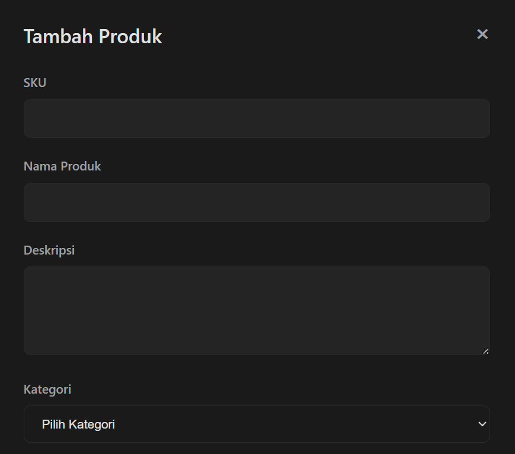

# InventoryPro - Sistem Inventaris Barang

Sistem manajemen inventaris barang berbasis web menggunakan PHP OOP murni (tanpa framework) dengan arsitektur clean code dan tampilan modern dark theme.

## Screenshot

*Dashboard dengan daftar produk*

*Form tambah produk*

## Fitur Utama

- ✅ CRUD Produk (Create, Read, Update, Delete)
- ✅ Search berdasarkan nama, SKU, atau deskripsi
- ✅ Filter produk berdasarkan kategori
- ✅ Validasi input form dengan error handling
- ✅ Notifikasi sukses/error real-time
- ✅ Dark theme UI modern dan responsif
- ✅ Indikator stok rendah (low stock warning)
- ✅ RESTful API architecture

## Teknologi

### Backend
- **PHP 8.0+** - Pure OOP without framework
- **MySQL 8.0+** - Database management
- **PDO** - Database connection with prepared statements
- **Composer** - Dependency management & autoloading

### Frontend
- **HTML5** - Semantic markup
- **CSS3** - Modern dark theme styling
- **Vanilla JavaScript** - No framework, pure JS
- **Fetch API** - Asynchronous HTTP requests

### Architecture
- **MVC Pattern** - Model-View-Controller inspired
- **Repository Pattern** - Data access abstraction
- **Service Layer** - Business logic separation
- **Dependency Injection** - Loose coupling
- **Clean Code** - SOLID principles

## Konsep OOP yang Diimplementasikan

### 1. Encapsulation
Semua properties menggunakan visibility modifiers dengan akses melalui getter/setter:
class Product extends BaseModel {
private int $id;
private string $sku;
private string $name;

text
public function getName(): string {
    return $this->name;
}
}

text

### 2. Inheritance
Hierarki class dengan pewarisan:
- `BaseModel` → `Product`, `Category`, `User`
- `BaseController` → `ProductController`, `CategoryController`
- `Exception` → `ValidationException`, `DatabaseException`

### 3. Polymorphism
Interface implementation dengan method yang sama tapi implementasi berbeda:
interface RepositoryInterface {
public function findAll(): array;
public function create(array $data): int;
}

class ProductRepository implements RepositoryInterface {
// Custom implementation
}

text

### 4. Abstraction
Abstract class dan interface untuk kontrak:
abstract class BaseModel {
abstract protected function getTableName(): string;
}

text

### 5. Design Patterns
- **Singleton**: Database connection
- **Repository**: Data access layer
- **Service Layer**: Business logic
- **Dependency Injection**: Constructor injection

## Struktur Project

- **inventory-system**
  - **config**
    - Database.php
  - **src**
    - **Core**
      - Application.php  
      - Router.php  
    - Request.php
    - **Database**
      - ConnectionInterface.php  
      - QueryBuilder.php  
      - DatabaseException.php  
    - **Models**
      - BaseModel.php  
      - Product.php  
      - Category.php  
    - **Controllers**
      - BaseController.php  
      - ProductController.php  
      - CategoryController.php  
    - **Services**
      - ValidatorInterface.php  
      - ProductValidator.php  
      - ValidationException.php  
    - **Repositories**
      - RepositoryInterface.php  
      - ProductRepository.php  
      - CategoryRepository.php  
  - **public**
    - **css**
      - style.css  
    - **js**
      - app.js  
    - index.php
  - **docs**
    - class-diagram.png  
    - **screenshots**
      - dashboard.png  
  - README.md  
  - .env.example  
  - composer.json  
  - license

## Requirements

- **PHP** >= 8.0
- **MySQL** >= 8.0
- **Composer** (untuk autoloading)
- **Web Server** (Apache/Nginx) atau **Laragon/XAMPP**

## Instalasi

### 1. Clone Repository

git clone https://github.com/username/inventory-system.git
cd inventory-system

text

### 2. Install Dependencies

composer install

text

### 3. Setup Database

Buat database dan import schema:

mysql -u root -p

text
undefined
CREATE DATABASE inventory_system;
USE inventory_system;
SOURCE database.sql;

text

Atau import via phpMyAdmin/HeidiSQL.

### 4. Konfigurasi Database

Edit file `config/Database.php` sesuai dengan kredensial database Anda:

$dsn = "mysql:host=localhost;dbname=inventory_system;charset=utf8mb4";
$username = "root";
$password = ""; // Sesuaikan dengan password MySQL Anda

text

Atau buat file `.env` (copy dari `.env.example`) dan sesuaikan:

DB_HOST=localhost
DB_NAME=inventory_system
DB_USER=root
DB_PASS=

text

### 5. Jalankan Aplikasi

#### Menggunakan PHP Built-in Server:

cd public
php -S localhost:8000

text

Akses: `http://localhost:8000/dashboard.html`

#### Menggunakan Laragon/XAMPP:

1. Copy folder project ke `C:/laragon/www/` atau `C:/xampp/htdocs/`
2. Start Apache & MySQL
3. Akses: `http://localhost/inventory-system/public/dashboard.html`

## Penggunaan

### Dashboard
Akses halaman utama untuk melihat daftar produk:
http://localhost:8000/dashboard.html

text

### API Endpoints

#### Get All Products
GET /api.php?path=products

text

#### Get Product by ID
GET /api.php?path=products/1

text

#### Create Product
POST /api.php?path=products
Content-Type: application/json

{
"sku": "TEST-001",
"name": "Produk Test",
"description": "Deskripsi produk",
"category_id": 1,
"quantity": 100,
"price": 50000,
"minimum_stock": 10
}

text

#### Update Product
PUT /api.php?path=products/1
Content-Type: application/json

{
"sku": "TEST-001",
"name": "Produk Updated",
"quantity": 150
}

text

#### Delete Product
DELETE /api.php?path=products/1

text

#### Search Products
GET /api.php?path=products&search=laptop

text

#### Filter by Category
GET /api.php?path=products&category=1

text

#### Get All Categories
GET /api.php?path=categories

text

## Database Schema

### Table: categories
| Column | Type | Description |
|--------|------|-------------|
| id | INT (PK) | Primary key |
| name | VARCHAR(100) | Category name (unique) |
| description | TEXT | Category description |
| created_at | TIMESTAMP | Creation timestamp |
| updated_at | TIMESTAMP | Update timestamp |

### Table: products
| Column | Type | Description |
|--------|------|-------------|
| id | INT (PK) | Primary key |
| sku | VARCHAR(50) | Product SKU (unique) |
| name | VARCHAR(200) | Product name |
| description | TEXT | Product description |
| category_id | INT (FK) | Foreign key to categories |
| quantity | INT | Stock quantity |
| price | DECIMAL(10,2) | Product price |
| minimum_stock | INT | Minimum stock threshold |
| created_at | TIMESTAMP | Creation timestamp |
| updated_at | TIMESTAMP | Update timestamp |

### Table: users
| Column | Type | Description |
|--------|------|-------------|
| id | INT (PK) | Primary key |
| username | VARCHAR(50) | Username (unique) |
| email | VARCHAR(100) | Email (unique) |
| password | VARCHAR(255) | Hashed password |
| role | ENUM | User role (admin/staff) |
| created_at | TIMESTAMP | Creation timestamp |

## Class Diagram

Sistem terdiri dari **19 classes** dengan relasi:
- **5 Inheritance** relationships
- **3 Interface** implementations
- **2 Custom Exceptions**
- **Multiple associations** dan dependencies

## Testing

### Test Database Connection

php public/test-autoload.php

text

### Test API Endpoints

Gunakan Postman, Insomnia, atau cURL:

Test get products
curl http://localhost:8000/api.php?path=products

Test get categories
curl http://localhost:8000/api.php?path=categories

text

## Troubleshooting

### Class not found error
composer dump-autoload -o

text

### Database connection failed
- Cek kredensial di `config/Database.php`
- Pastikan MySQL service running
- Pastikan database sudah dibuat

### API returns 404
- Pastikan akses via `api.php?path=...`
- Cek file `public/api.php` ada
- Cek console browser (F12) untuk error detail

## Contributing

Kontribusi sangat diterima! Silakan buat Pull Request dengan perubahan Anda.

1. Fork repository
2. Buat branch baru (`git checkout -b feature/AmazingFeature`)
3. Commit perubahan (`git commit -m 'Add some AmazingFeature'`)
4. Push ke branch (`git push origin feature/AmazingFeature`)
5. Buat Pull Request

## License

Distributed under the MIT License. See `LICENSE` file for more information.

## Author

**Nama Anda**
- GitHub: [@wewakskieee](https://github.com/wewakskieee)
- Email: muhammadfadli6n@gmail.com

## Acknowledgments

- Design inspiration dari modern dashboard templates
- PHP OOP best practices dari [PHP The Right Way](https://phptherightway.com)
- Clean architecture concepts

---

⭐ Jika project ini membantu, silakan berikan star!
